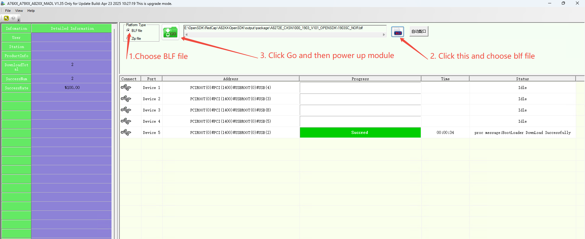
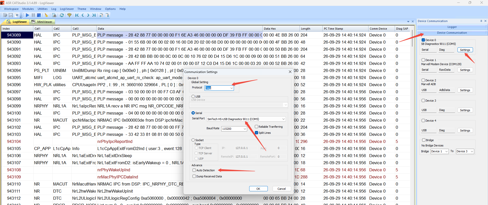
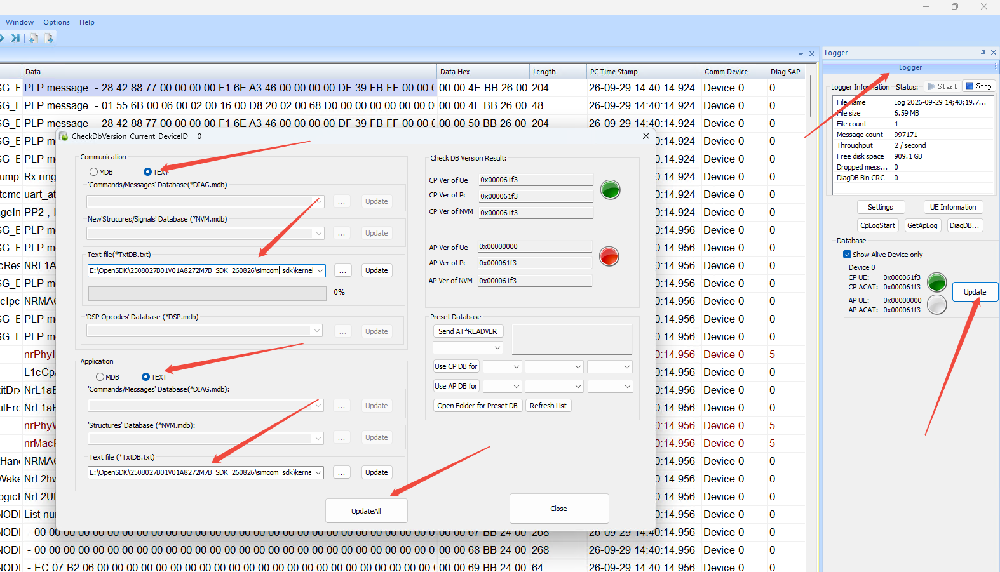
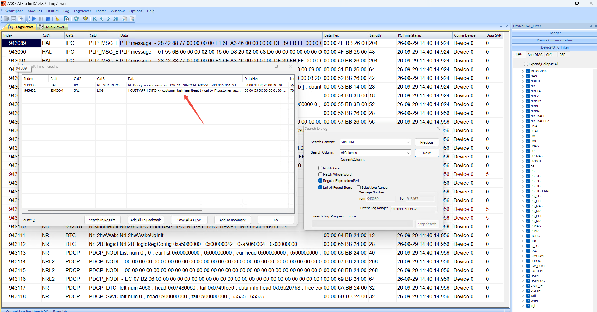
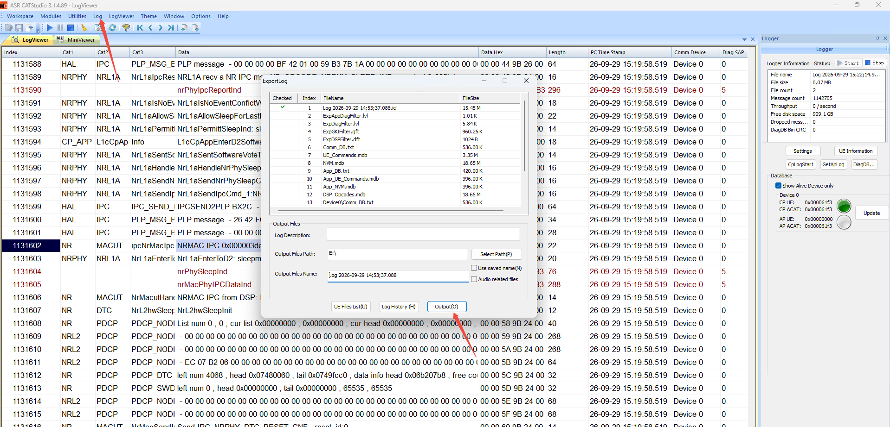

# Customer_Application

[English](README.md) | **简体中文**

一个可任意迁移的编译工作区：把 `customer_code/` 里的代码，用 **SIMCOM OpenSDK**（A1903 RTOS 系列 /
ASR 1903SR / `A8272E`）编译成可烧录的固件。

把它指向一个 SDK，运行 `build.bat`，你的代码会被复制进 SDK、用 SDK 自带的工具链在那里编译，固件再被复制回
`output/`。整个目录放在哪里都能用，而且它在 SDK 里留下的痕迹都有备份，用 `build.bat restore` 可以完整还原。

本文档前半部分讲这个目录本身；从 [SDK 参考](#sdk-参考)开始，是 OpenSDK 的手册内容 —— 放在这里是为了让这个
目录自成一体。

---

## 目录

- [Customer\_Application](#customer_application)
  - [目录](#目录)
  - [环境要求](#环境要求)
  - [快速开始](#快速开始)
  - [命令](#命令)
  - [工程结构](#工程结构)
  - [编写你的代码](#编写你的代码)
  - [编译产物](#编译产物)
  - [编译流程](#编译流程)
    - [Demo](#demo)
  - [配置](#配置)
  - [下载](#下载)
  - [调试](#调试)
  - [常见问题](#常见问题)
  - [SDK 参考](#sdk-参考)
    - [分离编译方案](#分离编译方案)
    - [SDK 目录结构](#sdk-目录结构)
      - [关键文件](#关键文件)
    - [SDK 包](#sdk-包)
    - [搭建编译环境](#搭建编译环境)
    - [在 SDK 根目录下编译](#在-sdk-根目录下编译)
      - [目标名](#目标名)
      - [SDK 编译产物](#sdk-编译产物)
      - [烧录包路径](#烧录包路径)
    - [按 SDK 原生方式添加模块](#按-sdk-原生方式添加模块)
      - [二次开发入口](#二次开发入口)
      - [添加子应用](#添加子应用)
    - [Debug 版本](#debug-版本)
  - [更多文档](#更多文档)

---

## 环境要求

| 工具 | 说明 |
| --- | --- |
| **Python 3** | SIMCOM 使用 3.8.5；更高版本一般也兼容。从 [python.org](https://www.python.org/) 安装，并确保 `python` 在系统 PATH 中 —— 安装程序没自动加就手动加上。 |
| **Python 第三方包** | `pip install kconfiglib windows-curses`。`kconfiglib` 的脚本目录也必须加进系统 PATH。在默认的 Windows 10 + Python 3.8 安装下，该目录是 `C:\Users\<user>\AppData\Local\Programs\Python\Python38\Scripts\`。 |
| **Git** | 提供 **git bash**。全部按默认选项安装即可。 |
| **SDK 工具包** | SDK 的 `tools/win32/` 必须已解压 —— 见 [SDK 包](#sdk-包)。 |

芯片原厂的一部分编译步骤是 shell 脚本，所以 SIMCOM 要求编译在类 Linux 的 shell 环境下进行 —— 用 git bash
而不是 Windows 原生终端。`build.bat` 已经替你处理了调用方式。

---

## 快速开始

1. 打开 [build.bat](build.bat)，把 `SDK_DIR` 设置成 SDK 根目录 —— 也就是包含 `build.py` 和 `kernel/` 的那一层：

   ```bat
   set "SDK_DIR=E:\OpenSDK\2508027B01V01A8272M7B_SDK_260826\simcom_sdk"
   ```

   这是你唯一需要改的一行。它下面的 `APP_TARGET` 可以留空；模块名会从 SDK 的 `kernel/` 目录自动探测。
   只有需要为某个特定模块编译时才设置它。

2. 把源文件放进 `customer_code\src\` —— 见[编写你的代码](#编写你的代码)。

3. 运行 `build.bat`。

4. 从 `output\` 取走固件 —— 见[编译产物](#编译产物)。

---

## 命令

```bat
build.bat                REM 编译，增量编译              （默认）
build.bat rebuild        REM 先 clean 本模块，再编译
build.bat clean          REM 删除编译输出
build.bat menuconfig     REM 配置功能开关，文本界面
build.bat guiconfig      REM 配置功能开关，图形界面
build.bat restore        REM 把 SDK 的原始文件放回去
build.bat help           REM 显示用法
```

在 `cmd.exe` 里运行即可 —— 双击运行、在本目录运行，或者在任意其他目录运行都行。

---

## 工程结构

```text
Customer_Application
|- build.bat            编译脚本；SDK_DIR 在文件开头设置
|- customer_code        全部代码 —— 你要改的就是这里
|  |- main.c            SDK 入口（会被复制覆盖 AL\APP\main.c）
|  |- CMakeLists.txt    把 src\ 下的所有源文件编成一个库
|  |- inc               头文件
|  |- src               源文件
|- output               编译产物，由 build.bat 写入
```

这里没有任何东西和当前位置绑定 —— 整个目录可以随意复制或移动。

---

## 编写你的代码

- **源文件** —— 放在 `customer_code\src\` 下的任何位置。所有 `.c` 文件都会被 `aux_source_directory`
  自动收集，所以新增文件不需要改 `CMakeLists.txt`。子目录*不会*被扫描；如果需要，用
  `list(APPEND PACKAGE_SRC_FILES ...)` 显式加进去。
- **头文件** —— `customer_code\inc\`，这个目录已经在 include 路径里了。
- **配置开关** —— `customer_code\inc\app_config.h`。
- **入口** —— `customer_code\src\app_main.c` 里的 `customer_app_main()`。它作为一个任务运行，紧跟在 SDK 的
  `open_at_init()` 和原厂 demo 菜单启动之后。模板代码创建了一个 `sal_task`，每 5 秒打一条心跳日志；
  把它换成你的应用即可。
- **`customer_code\main.c`** —— 一个特殊文件，也是唯一一个不在 `src\` 下的文件。SDK 的入口
  `userspace_main()` 和分离方案的四个全局变量都定义在 `<SDK>\AL\APP\main.c`，而 SDK 没有提供其他钩子
  来运行客户代码，所以这个文件是它的副本，只加了一行 `customer_app_main()` 调用。只有需要修改入口任务的
  栈/优先级，或者想去掉 `simcom_demo_init()` 时才需要动它。因为 `aux_source_directory` 只扫描 `src\`，
  这个副本*不会*被编进客户库 —— `build.bat` 把它复制覆盖到 `<SDK>\AL\APP\main.c`，由 SDK 在那里编译它。

SDK 根目录下的 HAL / MAL / SAL / PL 头文件说明了 SDK 提供的能力（GPIO、UART、I2C、SPI、PWM、ADC、
网络、socket、TLS、MQTT、HTTP、文件系统、FOTA 等）。各个外设的详细说明见 `../../Doc/` 里的文档。

---

## 编译产物

编译成功后，本目录下会有：

| 路径 | 说明 |
| --- | --- |
| `output\customer_app.elf` | 应用程序 ELF，含调试信息 |
| `output\customer_app.elf.map` | Map 文件 |
| `output\customer_app.elf.map.json` | 内存占用，从 map 文件解析得到 |
| `output\customer_app.bin` | 二进制固件 |
| `output\customer_app_crc.bin` | 带 CRC 的二进制固件 |
| `output\customer_app_lzma.bin` | LZMA 压缩后的二进制固件 |
| `output\customer_app_lzma_crc.bin` | 带 CRC 的 LZMA 压缩二进制固件 |
| `output\package\<module>\` | 烧录包：`customer_app.bin`、`customer_app_lzma.bin`、内核烧录文件 |
| `output\build_<module>.log` | 链接日志 |
| `output\simcom_build.log` | 编译日志 |

这些是 SDK 在自己 `output/<module>/APP/` 下产物的副本 —— 那一层的布局见 [SDK 编译产物](#sdk-编译产物)。
烧录包是应用程序编译过程中的自动产物；这个 SDK 里没有单独的打包步骤。

---

## 编译流程

每次编译都会执行这些步骤：

1. 备份 `<SDK>\AL\APP\main.c` → `main.c.simcom`、`CMakeLists.txt` → `CMakeLists.txt.simcom`，仅第一次。
2. 删除 `<SDK>\AL\APP\customer_code\`，再把 `customer_code\` 重新复制过去，这样被删掉的文件不会残留在 SDK 里。
3. 把 `customer_code\main.c` 复制覆盖到 `<SDK>\AL\APP\main.c`。
4. 向 `<SDK>\AL\APP\CMakeLists.txt` 追加一段 `add_subdirectory(customer_code)`，只追加一次。
5. 用 SDK 自带的 `python build.py <module>_app` 编译。
6. 把固件、日志和烧录包复制回 `output\`。

这就是对 SDK 的全部改动。`build.bat restore` 会撤销第 1~4 步，把 SDK 完全恢复成出厂时的样子。

### Demo

因为整个流程就是一次普通的 SDK 编译，SDK 自带的 demo 菜单（`V2`）保持完整，仍然可以通过 PC 端工具
`simcomDemoLinkerV2.exe` 访问。`customer_code\main.c` 正是为此调用了 `simcom_demo_init()`；如果你想要一个
不带 demo 的固件，把这一行调用删掉即可。

---

## 配置

功能裁剪走的是 SDK 自己的 Kconfig 树，所以在这里改的开关就是 SDK 编译时读的那一份：

```bat
build.bat guiconfig      REM 图形界面
build.bat menuconfig     REM 命令行界面
```

在 `guiconfig` 里，条目旁边有绿色叉号表示它参与编译，否则会被排除。**默认情况下只能裁剪 demo 和开源库**
—— SDK 内置的功能模块由编译系统自动配置。如果要多手工裁剪这些模块，需要先打开
**"Configure modules compilation manually."** 这一项，然后保存并关闭。

> 改完配置后必须执行 `build.bat rebuild`，否则改动不会生效。这是 SDK 自身的限制，不是本脚本的问题。

---

## 下载

请下载工具[A76XX_A79XX_A82XX_MADL V1.xx Only for Update](https://1drv.ms/u/c/1964fa2b798f638e/IQB8SBaiWRXmRpHm-QCf_mmlAb0mYBGcjFdkC4sUiEteEjI?e=2K78aa)，参照文档中ASR18XX系列的操作步骤进行驱动安装和烧录，一般需要选择`A82XX-OpenSDK\output\package\A8272E_CXSN1000_1903_V101_OPENSDK`里面的1903SC_NOR.blf作为配置文件。



---

## 调试

我们可以使用[CATStudio](https://1drv.ms/u/c/1964fa2b798f638e/IQF7g0k6X8r3J9j5q0nY1v7lA3xW8Zt5p6yG9sV2zL4?e=2K78aa)工具通过模块的USB端口抓取模块的log，它包含了所有涉及到模块网络、协议栈、AT命令、应用层的log信息，方便我们进行调试。

1. 连接模块的USB端口，打开CATStudio工具，选择对应的Diag端口进行连接。



2. 连接成功后，点击“Logger”按钮，点击“Update”选择Database文件，两个地方都选择`<SDK>\simcom_sdk\kernel\A8272E_CXSN1000_1903_V101_OPENSDK`里面的cp.mdb作为配置文件,最后点击“UpdateAll”，此时CATStudio工具就可以抓取模块的log了。



3. 使用Ctrl+F搜索关键字"SIMCOM"进行过滤，方便我们查看使用sal_log等函数打印的log信息。




4. 如果遇到网络问题或者其他问题需要抓取log给SIMCom的情况，请在CATStudio工具中点击“Log”按钮之后点击“Export Log File”保存log文件，并发送给SIMCom的技术支持人员。



---

## 常见问题

| 现象 | 处理 |
| --- | --- |
| `ERROR: no build.py under SDK_DIR` 或 `no kernel\ directory under SDK_DIR` | `build.bat` 开头的 `SDK_DIR` 没有指向 SDK 根目录。它必须是包含 `build.py` 和 `kernel/` 的那一层。 |
| `ERROR: cannot detect the module name` | `<SDK>\kernel\` 下没有找到模块目录。在 `build.bat` 开头显式设置 `APP_TARGET`。 |
| `ERROR: python is not on PATH` | 安装 Python 3 并加入 PATH —— 见[环境要求](#环境要求)。 |
| 编译在解压 `cmake.zip` / `cross_tool.zip` 时失败 | SDK 的 `tools/win32/` 包没放 —— 见 [SDK 包](#sdk-包)。 |
| 改了配置却没有生效 | 执行 `build.bat rebuild`。Kconfig 改动后 SDK 要求先 clean。 |
| 编译明明失败了，日志却看不出问题 | `build.py` 无论成功失败都返回 `0`，只打印一行标记。`build.bat` 是靠读取 `output\build_<module>.log` 里的 `>>>>> build successed. <<<<<` 来判断的，所以以它最后打印的 `BUILD SUCCEEDED` / `BUILD FAILED` 为准。 |
| 想把对 SDK 的改动还原 | 执行 `build.bat restore`。它会从 `.simcom` 备份恢复 `AL\APP\main.c` 和 `AL\APP\CMakeLists.txt`，并删掉 `AL\APP\customer_code\`。 |

---

## SDK 参考

从这里开始的内容讲的是 SDK 本身，与这个目录无关。SDK 是 SIMCOM 面向 A1903 RTOS 系列的二次开发包：它通过
分层的 C API 把模组的硬件和网络能力开放出来，让应用代码可以脱离原厂固件独立编写和编译。

| | |
| --- | --- |
| 目标模组名 | `A8272E` |
| 芯片平台 | ASR 1903SR |
| 编译器目标 | ARM Cortex-R5 |
| 编译方案 | **分离方案** —— 应用和内核分开编译、烧录到不同分区 |

### 分离编译方案

分离方案下，应用代码和内核代码被**分区、分别编译**，生成两个独立的二进制文件，烧录到不同的分区。

SDK 的交付形式：

- **内核**只以预编译二进制发布（`kernel/` 下的 `cp.bin` / `cp.elf`）。
- **应用层**分两部分发布 —— 闭源部分以静态库形式给出，开源部分以源码形式给出。

整个编译流程是：开源的应用源码被编译成若干库，这些库再和闭源库一起链接成 ELF 文件，最终由该 ELF 生成
可烧录的二进制。

由于这套方案刻意剥离了芯片原厂的编译框架，**SDK 根目录*就是*二次开发的入口根目录**。

> **重要：** 应用和内核位于不同的代码空间，**彼此之间不能互相调用函数**。应用代码只能使用 SIMCOM 开放
> 出来的 API。

### SDK 目录结构

```text
SIMCOM_SDK
|- HAL                      驱动层标准 API 封装
|- MAL                      模组层标准 API 封装
|- SAL                      偏应用的标准 API 封装
|- PL                       协议层标准 API 封装
|- AL                       应用层
|  |- APP                   OpenSDK 应用层代码
|  |  |- demo               OpenSDK 示例代码，通过 PC 端工具交互（工具在 tools/ 里）
|  |  |  |- V2              V2 示例（使用 sAPI 里的旧版 API）
|  |  |  |- V3              V3 示例（尚未实现；使用标准 HAL/MAL/SAL/PL API）
|  |  |- main.c             OpenSDK 代码入口
|  |- cmd_ui_protocol       PC 端工具通信协议。客户代码可以直接使用；
|  |                        用法参考 demo —— 没有单独的文档。
|  |- sAPI                  旧版 API 实现（对 HAL/MAL/SAL/PL 的封装）
|- Pub                      公共工具函数实现，可选；无文档支持
|- ThirdLibrary             开源库
|- configs                  OpenSDK 配置文件
|- tools                    编译工具
|  |- script                编译脚本
|  |- linux                 Linux 下编译用的工具（并非每个 SDK 都支持）
|  |- win32                 Windows 下编译用的工具
|- kernel                   内核输出文件
|- output                   编译输出目录
|- CMakeLists.txt           编译脚本入口
|- build.py                 编译命令入口
```

本 `Customer_Application/` 目录**不属于**上面这棵树 —— 它和 SDK 平级，由 `build.bat` 复制进 `AL/APP/`
（见[编译流程](#编译流程)）。

`linux` 和 `win32` 两个工具目录是**单独发布**的，不在 SDK 主包里 —— 见 [SDK 包](#sdk-包)。

#### 关键文件

| 路径 | 作用 |
| --- | --- |
| `build.py` | 编译命令入口。不带参数运行会打印使用手册。 |
| `CMakeLists.txt` | 顶层 CMake 入口，驱动各层的子目录。 |
| `AL/APP/main.c` | 应用入口（`userspace_main`）。 |
| `configs/<厂商>/<型号>/Kconfig` | 功能配置源文件；驱动 `guiconfig` / `menuconfig`。 |
| `tools/script/` | 编译辅助脚本（Kconfig 解析、链接脚本生成、map 文件统计）。 |

### SDK 包

由于工具目录体积较大且很少变动，它们被单独打包成压缩包。因此 SDK 一共分为**三个包**：

1. **主包** —— 去掉工具的 SDK，快速上手可以从这个链接获取：[主包](https://1drv.ms/u/c/1964fa2b798f638e/IQCBbMDSRD_YT5amv-ughj0iAcUL4Iw01Ja6k6wzwOoLQSg?e=b3ajug)
2. **Linux 工具包**，从这个链接获取：[Linux 工具包](https://1drv.ms/u/c/1964fa2b798f638e/IQDgdDYVqxguSbFFxFarbI1rAYkev2LrM_oHaLoq0FPK8RI?e=cb14MI)
3. **Windows 工具包**，从这个链接获取：[Windows 工具包](https://1drv.ms/u/c/1964fa2b798f638e/IQCXJmuOsnJtQLeha68vZz7rAS_4iGl4n06BC-9SrG9ZOKU?e=B0yQnZ)

拿到 SDK 后，把工具包解压到 [SDK 目录结构](#sdk-目录结构)里标注的位置 —— 也就是 `tools/linux/` 和
`tools/win32/`。

> 只从主包解压出来的 SDK 里只有 `tools/script/`。必须先补上 `tools/win32/` 或 `tools/linux/`，编译才能跑起来。

### 搭建编译环境

标准编译环境由 **Python、CMake 和 Ninja** 组成。Python 是主入口，CMake 负责生成编译脚本，Ninja 执行实际编译。

CMake 和 Ninja 已经打包在工具包里。**Python 需要客户自行安装。** 部分芯片原厂的编译步骤使用 shell 脚本，
所以编译必须在类 Linux 的 shell 环境下运行 —— SIMCOM 使用 **git bash**，这意味着**还必须安装 git**。
编译一旦启动，工具的配置由 Python 脚本自动处理。

完整的工具和依赖清单见[环境要求](#环境要求)。

### 在 SDK 根目录下编译

下面是 SDK 的原生命令。本目录的 `build.bat` 只是对它们的封装 —— 见[命令](#命令)。

1. 在 SDK 根目录打开 **git bash**。

2. 不带参数运行 `./build.py`，会打印使用手册。如果遇到权限问题，改用 `python build.py`。两种写法都行；
   优先用 `./build.py`，不行再退回 `python build.py`。

3. 传入目标名来编译某个模块：

   ```bash
   ./build.py A8272E_CXSN1000_1903_V101_OPENSDK
   ```

   编译产物出现在 SDK 根目录下的 `output/` 里。

4. 清理生成的文件：

   ```bash
   ./build.py clean
   ```

#### 目标名

目标可以是裸的模块名，也可以是模块名加后缀：

| 后缀 | 含义 |
| --- | --- |
| *（无）* | 完整编译 |
| `_app` | 只编译应用 |
| `_clean` | 清理该模块 |
| `_clean_app` | 只清理应用的编译结果 |

此外还有独立的清理目标 —— `clean`、`clean_config`、`clean_all` —— 以及配置目标 `menuconfig`（文本）
和 `guiconfig`（图形）。

> **关于内核。** 本 SDK 以预编译形式发布，CP 内核无法从中重新编译 —— `kernel/` 目录里放的就是最终的二进制。
> 因此没有 `_kernel` 目标，完整编译中的内核步骤会被自动跳过。（`_kernel`、`_install`、`install` 和
> `upgrade` 只存在于非发布版的开发 SDK 中。）
>
> **关于打包。** 也没有 `_package` 目标 —— 烧录包是应用编译的一个 `POST_BUILD` 步骤自动产生的，所以只跑
> `_app` 就能在 `output/package/<模块名>/` 下拿到烧录包。

可选参数：

| 参数 | 含义 |
| --- | --- |
| `J=<n>` | 并行编译的任务数；默认为 CPU 核心数。 |
| `-c` | 编译前先清理该目标。 |

#### SDK 编译产物

对 ASR 系列，编译 `A8272E_CXSN1000_1903_V101_OPENSDK` 会在
`output/A8272E_CXSN1000_1903_V101_OPENSDK/` 下产生：

| 文件 | 说明 |
| --- | --- |
| `APP/customer_app.elf` | 应用目标文件，**含调试信息** |
| `APP/customer_app.elf.map` | Map 文件 |
| `APP/customer_app.bin` | 二进制固件 |
| `APP/customer_app_crc.bin` | 带 CRC 的二进制固件 |
| `APP/customer_app_lzma.bin` | LZMA 压缩后的二进制固件 |
| `APP/customer_app_lzma_crc.bin` | 带 CRC 的 LZMA 压缩二进制固件 |
| `APP/sc_buildlog.txt` | 链接日志 |
| `simcom_build.log` | 编译日志 |

`APP/` 里的其他文件都是中间编译产物。

#### 烧录包路径

对 ASR 18 和 19 系列，烧录包写到：

```text
./output/package/<模块名>/
```

### 按 SDK 原生方式添加模块

这是 SDK 自带的扩展方式：代码放在 SDK 树**内部**的 `AL/APP/` 下。如果你更希望把代码放在自己的目录或自己的
仓库里，就改用本工作区 —— 见[快速开始](#快速开始)。

#### 二次开发入口

二次开发代码的入口是 `AL/APP/main.c` 里的 `void userspace_main(void *args)` 函数（路径见
[关键文件](#关键文件)）。

这个函数作为一个任务的入口。该任务默认栈大小为 4K，默认优先级为 `sal_task_priority_low_1`。
**当函数返回时，任务会被自动删除。**

如果要移除原厂的 `main.c`：

1. 删除 `main.c`。
2. 在同一目录的 `CMakeLists.txt` 中，只保留 `add_subdirectory(demo)` 这一行以及包着它的 `if` 条件，
   其余全部删掉。
3. 如果连 demo 也不需要，就把这个 `CMakeLists.txt` 的内容全部清空 —— 但**文件本身不能删除**。

之后你必须在自己的代码里实现自己的 `void userspace_main(void *args)`。

分离方案下，你还必须像 `main.c` 那样声明以下全局变量：

| 变量 | 作用 |
| --- | --- |
| `char g_app_version[20];` | 应用版本号（预留）。 |
| `char *g_main_stack;` | 入口任务的栈；`NULL` 表示自动分配。 |
| `unsigned int g_main_stack_size = SAL_8K;` | 入口任务的栈大小。当 `g_main_stack` 非 `NULL` 时，按这个大小分配。 |
| `enum sal_task_priority g_main_task_priority = sal_task_priority_low_1;` | 入口任务的优先级。 |

这四个全局变量在分离方案下控制入口任务的创建。一体化方案不需要它们，也无法控制入口任务的创建参数。

#### 添加子应用

默认情况下，应用代码放在 `./AL/APP` 下。

以一个名为 `new_app` 的应用为例：

1. 在 `./AL/APP` 下创建 `new_app` 目录。
2. 把源文件放进 `./AL/APP/new_app`。
3. 在 `./AL/APP/new_app` 下添加 `CMakeLists.txt` 文件。
4. 在 `./AL/APP/new_app/CMakeLists.txt` 里写编译脚本。
5. 在 `./AL/APP/CMakeLists.txt` 里加上 `add_subdirectory(new_app)`。

最终目录结构：

```text
./AL/APP
|- new_app
|  |- sourc1.c
|  |- source2.c
|  |- source3.c
|  |- header1.h
|  |- header2.h
|  |- CMakeLists.txt
|  |- sub_dir
|     |- source4.c
|     |- sources5.c
|     |- header3.h
```

`./AL/APP/new_app/CMakeLists.txt` 示例：

```cmake
# 设置应用名；它会成为编译出来的库名。
set(PACKAGE_NAME new_app)

# 设置编译选项。"-Werror" 表示把所有警告当成错误。
set(PACKAGE_PRIVATE_C_FLAGS "-Werror")

set(PACKAGE_INC_PATHS)
set(PACKAGE_SRC_FILES)

# 设置头文件搜索路径。
list(APPEND PACKAGE_INC_PATHS
    ./
    ./sub_dir
    ../../sAPI
    ../../../SAL/inc
    ../../../SAL/${CHIP_VENDOR}
    ../../../MAL/inc
    ../../../MAL/${CHIP_VENDOR}
    ../../../HAL/inc
    ../../../HAL/${CHIP_VENDOR}
    ../../../PL
    ../../../Pub
)

# 把本目录下所有源文件加入 PACKAGE_SRC_FILES。
aux_source_directory(${CMAKE_CURRENT_SOURCE_DIR} PACKAGE_SRC_FILES)

# 加入 sub_dir 子目录里的 source4.c 和 sources5.c。
list(APPEND PACKAGE_SRC_FILES
    ./sub_dir/source4.c
    ${CMAKE_CURRENT_SOURCE_DIR}/sub_dir/sources5.c
)

# 把 PACKAGE_SRC_FILES 里的所有内容编译成一个库。
sc_build_and_link_module(${PACKAGE_NAME} "${PACKAGE_SRC_FILES}" "${PACKAGE_INC_PATHS}" "" "${PACKAGE_PRIVATE_C_FLAGS}" "" "" "")
```

### Debug 版本

**如何启用。** 在 `guiconfig` 里打开 debug 选项即可编译 Debug 版本。

**它做了什么。** Debug 版本用一条链表来统计 OS 接口的使用情况。每新分配一个资源就记录到链表里，释放时从
链表中移除。

由于多了这套链表记账，Debug 版本**会占用更多内存，并加剧内存碎片**。它的用途是调试 —— 排查内存泄漏。
**生产固件中绝对不能启用。**

**如何使用。** Debug 版本提供了一条打印统计信息的 AT 命令：

```text
AT+MEMORYINFO
```

因为是通过 AT 触发的，所以需要有可用的 AT 口才能下发这条命令。

---

## 更多文档

SDK 旁边（`../../Doc/`）还提供了额外的应用指南，覆盖各个外设和功能：

- Device API、GPIO、UART、I2C、SPI、ADC、PWM
- RTOS 开发、低功耗开发
- 网络注册、TCP/UDP 通信、SSL、HTTP、FTP、MQTT、NTP/HTP
- 文件系统、FOTA
- 通话、短信、SIM
- 基站定位
